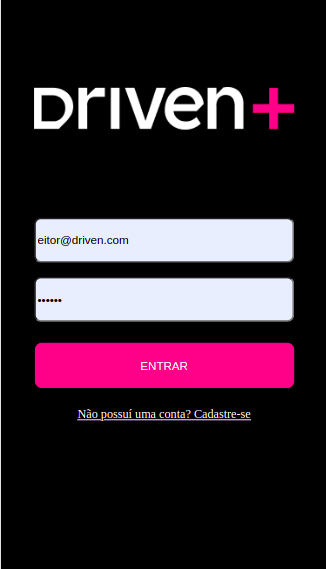
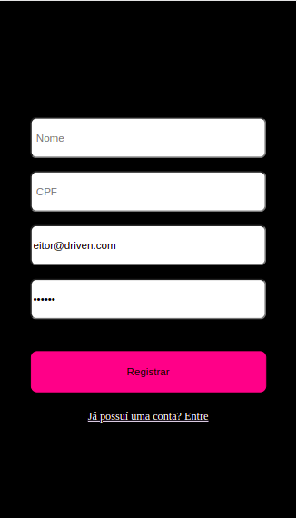
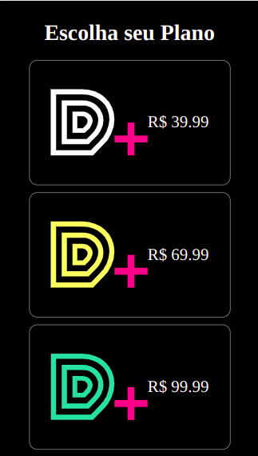
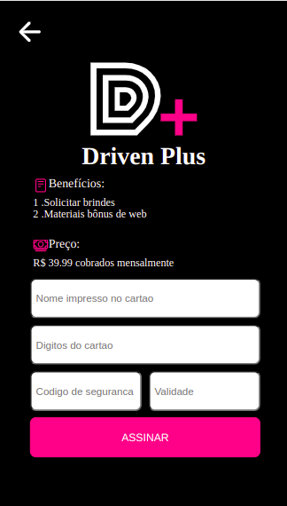
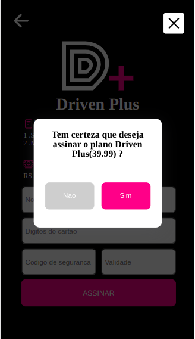

<h1>Subscription of plans</h1>

<h3>Application made in a responsive way, using react, javascript and styled components</h3>

<h6>Register, log in , choose a plan and confirm the purchase with a credit card</h6>

  

